# Cafe System — UML & System Diagrams

> **Tool:** All diagrams use [Mermaid](https://mermaid.js.org/) syntax.  
> **Render:** [mermaid.live](https://mermaid.live) · VS Code extension **"Markdown Preview Mermaid Support"** (Mermaid v10+).

---

## Table of Contents

1. [System Overview Diagrams](#1-system-overview-diagrams)
2. [Use Case Diagrams](#2-use-case-diagrams)
3. [Activity Diagrams](#3-activity-diagrams)
4. [Sequence Diagrams](#4-sequence-diagrams)
5. [ERD — Entity Relationship Diagrams](#5-erd--entity-relationship-diagrams)
6. [Class Diagrams](#6-class-diagrams)
7. [Project Management](#7-project-management)

---

## 1. System Overview Diagrams

### 1.1 — Functional Decomposition Diagram (FDD)

```mermaid
---
title: "Functional Decomposition Diagram — Café Management System"
---
%%{init: {"flowchart": {"curve": "step", "nodeSpacing": 80, "rankSpacing": 100}} }%%
graph TD
    classDef system   fill:#7c3aed,stroke:#5b21b6,color:#fff,font-weight:bold
    classDef subsys   fill:#1e40af,stroke:#1d4ed8,color:#fff,font-weight:bold
    classDef module   fill:#0e7490,stroke:#0891b2,color:#fff
    classDef support  fill:#059669,stroke:#047857,color:#fff

    CMS["Café Management System"]:::system

    S1["Subsystem 1:<br/>Authentication & User Management"]:::subsys
    S2["Subsystem 2:<br/>Order, Table & Payment Management"]:::subsys
    S3["Subsystem 3:<br/>Stock, Reporting & System Configuration"]:::subsys

    A1["User Login & Authentication"]:::module
    A2["OTP Email Verification"]:::module
    A3["Password Reset"]:::module
    A4["Staff Account Management"]:::module
    A5["Role & Permission Management"]:::module

    O1["Order Management"]:::module
    O2["Kitchen Display System"]:::module
    O3["Table Session Management"]:::module
    O4["Table Booking System"]:::module
    O5["Payment Processing"]:::module
    O6["Bill Splitting & Refunds"]:::module
    O7["Cash Shift Closing"]:::module

    R1["Stock Management"]:::module
    R2["Business Insights & Reports"]:::module
    R3["Menu & Category Management"]:::module
    R4["Discount Engine"]:::module
    R5["System Settings Configuration"]:::module

    API["ASP.NET Core Web API (C#)"]:::support
    DB["SQL Server Database"]:::support
    CACHE["Real-time Communication (SignalR)"]:::support
    FE["React.js Frontend"]:::support

    CMS --> S1 & S2 & S3
    S1 --> A1 & A2 & A3 & A4 & A5
    S2 --> O1 & O2 & O3 & O4 & O5 & O6 & O7
    S3 --> R1 & R2 & R3 & R4 & R5

    S1 & S2 & S3 --> API
    API --> DB & CACHE
    CACHE --> FE
```

---

### 1.2 — System Architecture Overview

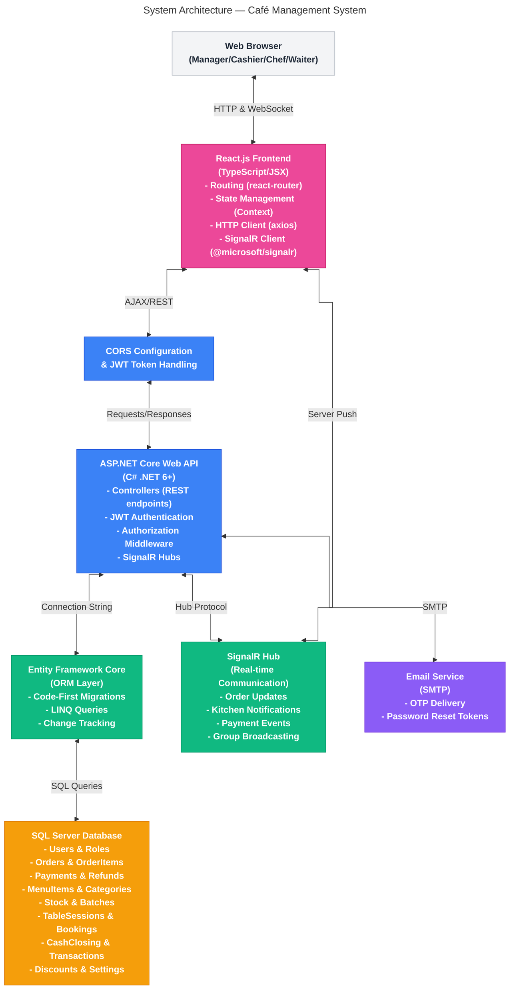

---

## 2. Use Case Diagrams

### 2.1 — Authentication (All Roles)

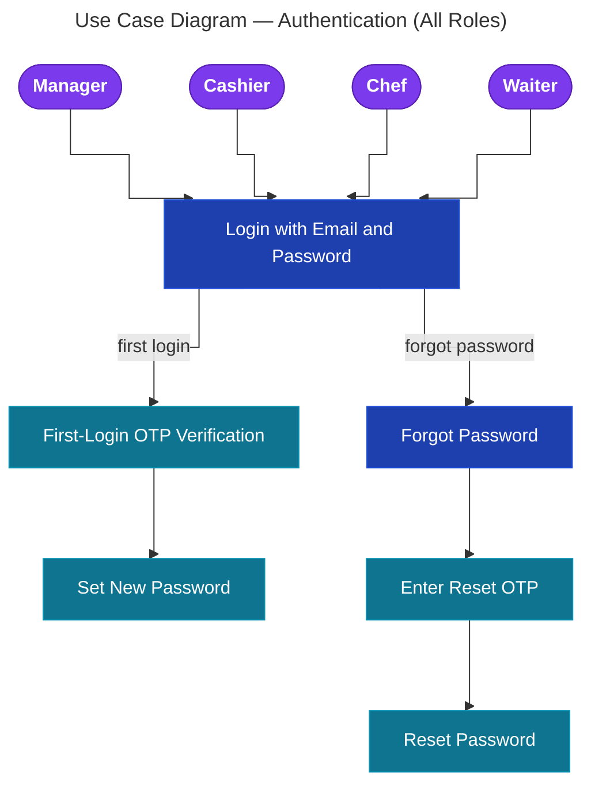

---

### 2.2 — Manager Use Cases

```mermaid
---
title: "Use Case Diagram — Manager"
---
%%{init: {"flowchart": {"curve": "step", "nodeSpacing": 60, "rankSpacing": 80}} }%%
flowchart TD
    classDef actor   fill:#7c3aed,stroke:#5b21b6,color:#fff,font-weight:bold
    classDef usecase fill:#1e40af,stroke:#1d4ed8,color:#fff

    M([Manager]):::actor

    subgraph SM["Staff Management"]
        UC1[Create Staff Account]:::usecase
        UC2[Edit Staff Details]:::usecase
        UC3[Set Staff Permissions]:::usecase
        UC4[Reset Staff Password]:::usecase
    end

    subgraph MD["Menu and Discounts"]
        UC5[Add and Edit Menu Items]:::usecase
        UC6[Manage Categories]:::usecase
        UC7[Configure Discounts]:::usecase
        UC8[Toggle Item Availability]:::usecase
    end

    subgraph RF["Reports and Finance"]
        UC9[View Business Insights]:::usecase
        UC10[View Cash Closing Records]:::usecase
        UC11[Manage Cash Transactions]:::usecase
    end

    subgraph SC["System Configuration"]
        UC12[Configure System Settings]:::usecase
        UC13[Manage Stock Items]:::usecase
        UC14[View Stock Levels]:::usecase
    end

    M --> UC1 & UC2 & UC3 & UC4
    M --> UC5 & UC6 & UC7 & UC8
    M --> UC9 & UC10 & UC11
    M --> UC12 & UC13 & UC14
```

---

### 2.3 — Cashier Use Cases

```mermaid
---
title: "Use Case Diagram — Cashier"
---
%%{init: {"flowchart": {"curve": "step", "nodeSpacing": 60, "rankSpacing": 80}} }%%
flowchart TD
    classDef actor   fill:#7c3aed,stroke:#5b21b6,color:#fff,font-weight:bold
    classDef usecase fill:#1e40af,stroke:#1d4ed8,color:#fff

    C([Cashier]):::actor
    Cust([Customer]):::actor

    subgraph OM["Order Management"]
        UC1[Take Dine-in Order]:::usecase
        UC2[Take Takeaway Order]:::usecase
        UC3[Apply Discount to Order]:::usecase
        UC4[Add Special Request to Item]:::usecase
    end

    subgraph TB["Table and Booking"]
        UC5[Open Table Session]:::usecase
        UC6[Close Table Session]:::usecase
        UC7[Create Table Booking]:::usecase
        UC8[Link Order to Booking]:::usecase
    end

    subgraph PR["Payment and Refund"]
        UC9[Process Cash Payment]:::usecase
        UC10[Process Card Payment]:::usecase
        UC11[Process Mobile Payment]:::usecase
        UC12[Split Bill Among Payers]:::usecase
        UC13[Process Full Refund]:::usecase
        UC14[Process Partial Refund]:::usecase
    end

    subgraph SH["Shift"]
        UC15[Close Cash Shift]:::usecase
        UC16[Enter Cash Drawer Count]:::usecase
    end

    C --> UC1 & UC2 & UC3 & UC4
    C --> UC5 & UC6 & UC7 & UC8
    C --> UC9 & UC10 & UC11 & UC12 & UC13 & UC14
    C --> UC15 & UC16
    Cust --> UC1 & UC2 & UC7
```

---

### 2.4 — Chef & Waiter Use Cases

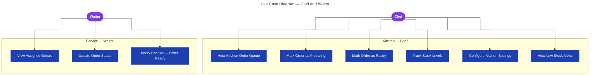

---

## 3. Activity Diagrams

### 3.1 — Authentication Flow

```mermaid
---
title: "Activity Diagram — Authentication Flow"
---
%%{init: {"flowchart": {"curve": "step", "nodeSpacing": 60, "rankSpacing": 80}} }%%
flowchart TD
    classDef startEnd fill:#059669,stroke:#047857,color:#fff,font-weight:bold
    classDef process  fill:#1e40af,stroke:#1d4ed8,color:#fff
    classDef decision fill:#b45309,stroke:#92400e,color:#fff
    classDef redirect fill:#0e7490,stroke:#0891b2,color:#fff

    Start([User Opens App]):::startEnd
    A[Enter Email and Password]:::process
    B{Credentials Valid?}:::decision
    C[Show Error Message]:::process
    D{Is First Login?}:::decision
    E[Send OTP to Email]:::process
    F[User Enters OTP]:::process
    G{OTP Valid?}:::decision
    H[Show OTP Error]:::process
    I[Prompt Set New Password]:::process
    J[User Sets Password]:::process
    K[Mark IsFirstLogin = false]:::process
    L[Generate JWT Token]:::process
    M{Check Role}:::decision
    N[/manager]:::redirect
    O[/cashier]:::redirect
    P[/chef]:::redirect
    Q[/waiter]:::redirect

    Start --> A --> B
    B -- No --> C --> A
    B -- Yes --> D
    D -- Yes --> E --> F --> G
    G -- No --> H --> F
    G -- Yes --> I --> J --> K --> L
    D -- No --> L
    L --> M
    M -- Manager --> N
    M -- Cashier --> O
    M -- Chef --> P
    M -- Waiter --> Q
```

---

### 3.2 — Forgot / Reset Password Flow

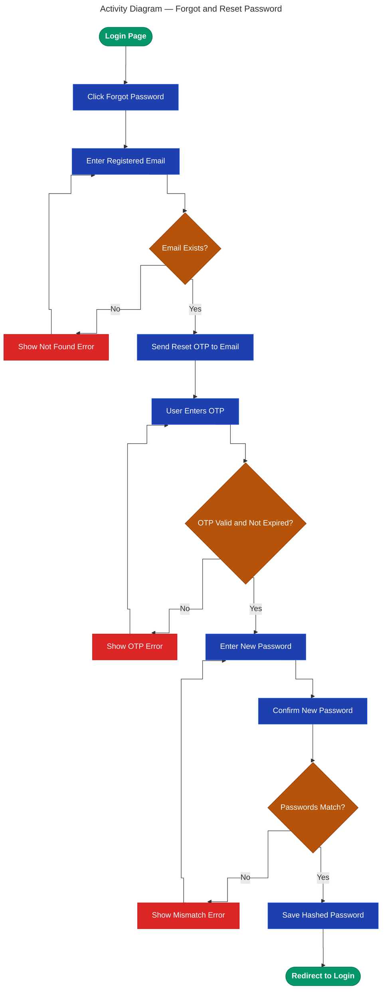

---

### 3.3 — Order Creation (Part A)

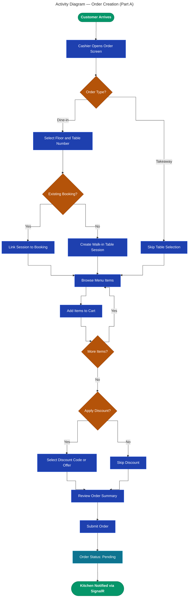

---

### 3.4 — Kitchen & Payment (Part B)

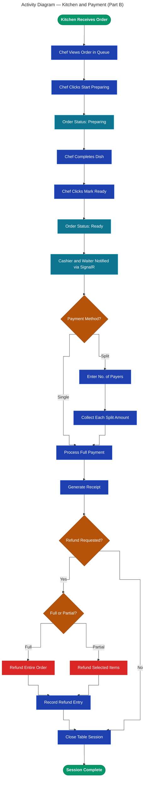

---

### 3.5 — Cash Closing (Shift End)

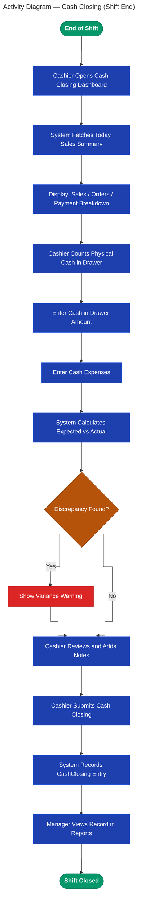

---

## 4. Sequence Diagrams

### 4.1 — Login & Authentication

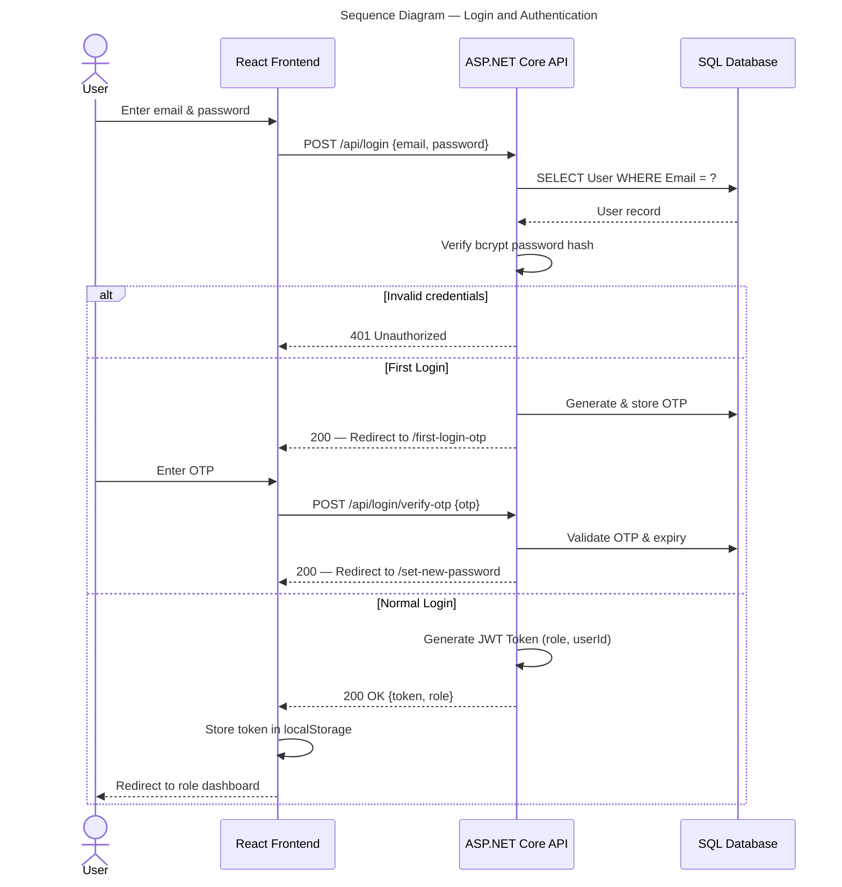

---

### 4.2 — Cashier Places an Order

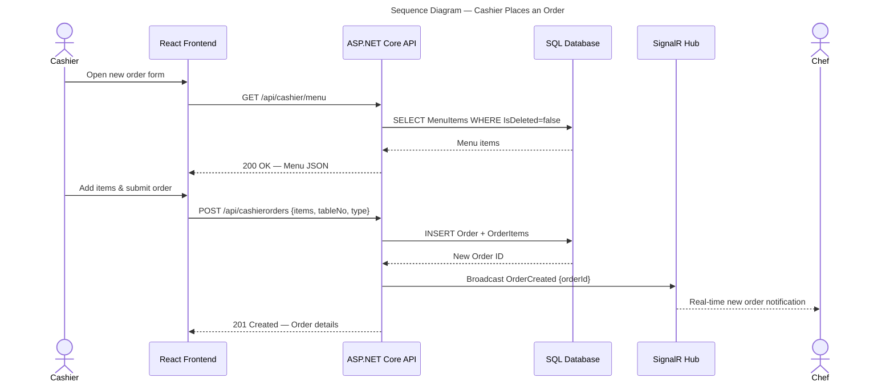

---

### 4.3 — Kitchen Status Update

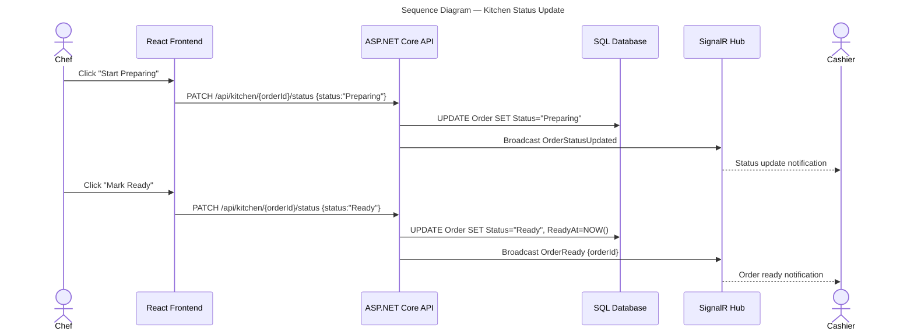

---

### 4.4 — Payment Processing

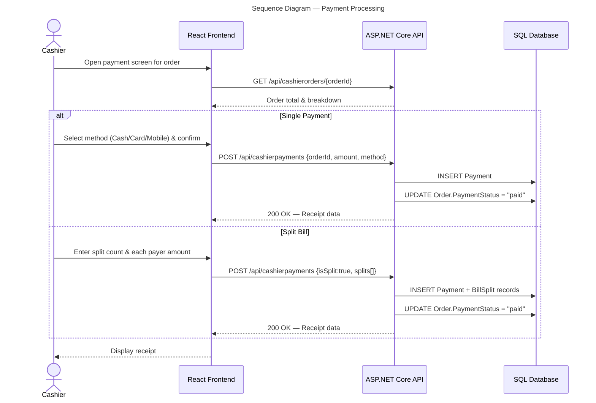

---

### 4.5 — Table Booking Flow

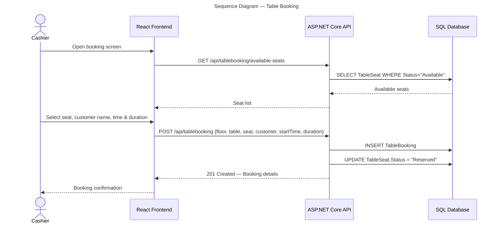

---

## 5. ERD — Entity Relationship Diagrams

### 5.1 — Users & Authentication

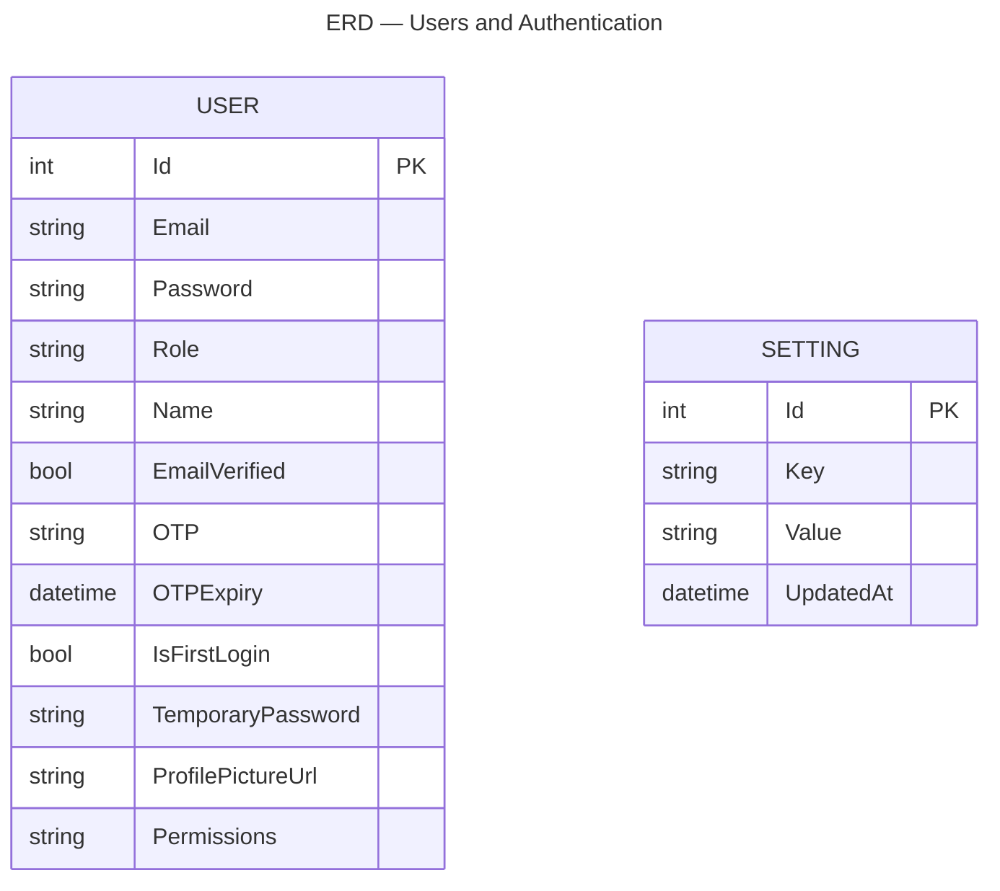

---

### 5.2 — Orders & Payments

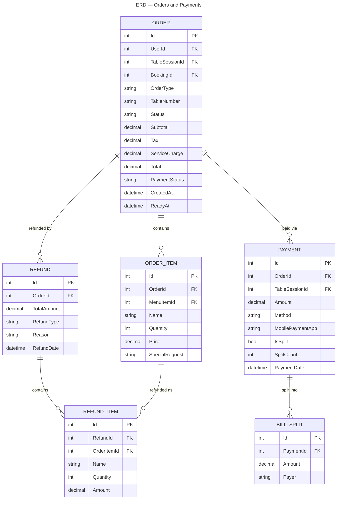

---

### 5.3 — Menu & Discounts

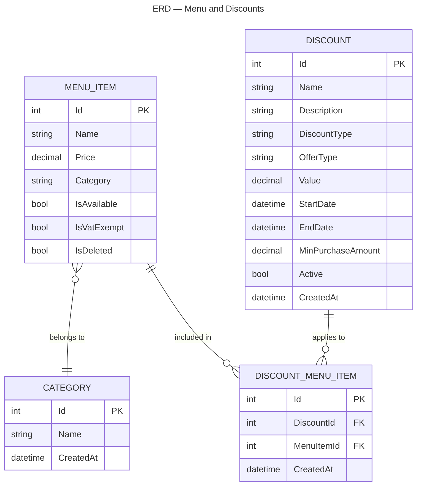

---

### 5.4 — Tables, Sessions & Bookings

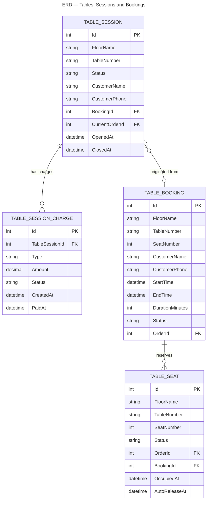

---

### 5.5 — Stock & Cash Management

```mermaid
---
title: "ERD — Stock and Cash Management"
---
erDiagram
    STOCK_ITEM {
        int Id PK
        string Name
        decimal CurrentStock
        decimal MinStock
        string Unit
        string Category
        bool LowStock
        decimal DailyDecayRate
        datetime LastDecayUpdate
    }
    STOCK_BATCH {
        int Id PK
        int StockItemId FK
        decimal Quantity
        decimal CostPerUnit
        datetime ExpiryDate
        datetime CreatedAt
    }
    STOCK_TRANSACTION {
        int Id PK
        int StockItemId FK
        string TransactionType
        decimal Quantity
        string Reason
        datetime CreatedAt
    }
    CASH_CLOSING {
        int Id PK
        datetime Date
        decimal TotalSales
        int TotalOrders
        decimal CashInDrawer
        decimal OpeningCash
        decimal CashExpenses
        decimal CashSales
        decimal CardSales
        decimal MobileSales
        int SubmittedByUserId FK
        datetime ClosedAt
    }
    CASH_TRANSACTION {
        int Id PK
        datetime Date
        string Type
        decimal Amount
        string Reason
        int UserId FK
    }

    STOCK_ITEM ||--o{ STOCK_BATCH : "stocked via"
    STOCK_ITEM ||--o{ STOCK_TRANSACTION : "tracked by"
```

---

## 6. Class Diagrams

### 6.1 — User Role Hierarchy

```mermaid
---
title: "Class Diagram — User Role Hierarchy"
---
classDiagram
    class User {
        +int Id
        +string Email
        +string Password
        +string Role
        +string Name
        +bool EmailVerified
        +string OTP
        +DateTime OTPExpiry
        +bool IsFirstLogin
        +string ProfilePictureUrl
        +string Permissions
    }
    class Manager {
        +ManageStaff()
        +SetPermissions()
        +ConfigureSettings()
        +ViewReports()
        +ManageMenu()
        +ManageStock()
        +ManageDiscounts()
        +ManageCash()
    }
    class Cashier {
        +PlaceOrder()
        +ProcessPayment()
        +SplitBill()
        +ProcessRefund()
        +ManageTableSession()
        +CreateBooking()
        +CloseShift()
    }
    class Chef {
        +ViewOrders()
        +MarkPreparing()
        +MarkReady()
        +TrackStock()
        +ConfigureKitchen()
    }
    class Waiter {
        +ViewOrders()
        +UpdateOrderStatus()
        +NotifyCashier()
    }

    User <|-- Manager
    User <|-- Cashier
    User <|-- Chef
    User <|-- Waiter
```

---

### 6.2 — Order & Payment Classes

```mermaid
---
title: "Class Diagram — Order and Payment"
---
classDiagram
    class Order {
        +int Id
        +int UserId
        +int TableSessionId
        +string OrderType
        +string TableNumber
        +string Status
        +decimal Subtotal
        +decimal Tax
        +decimal ServiceCharge
        +decimal Total
        +string PaymentStatus
        +DateTime CreatedAt
        +DateTime ReadyAt
        +List~OrderItem~ Items
    }
    class OrderItem {
        +int Id
        +int OrderId
        +int MenuItemId
        +string Name
        +int Quantity
        +decimal Price
        +string SpecialRequest
    }
    class Payment {
        +int Id
        +int OrderId
        +decimal Amount
        +string Method
        +string MobilePaymentApp
        +bool IsSplit
        +int SplitCount
        +DateTime PaymentDate
    }
    class BillSplit {
        +int Id
        +int PaymentId
        +decimal Amount
        +string Payer
    }
    class Refund {
        +int Id
        +int OrderId
        +decimal TotalAmount
        +string RefundType
        +string Reason
        +DateTime RefundDate
        +List~RefundItem~ RefundItems
    }
    class RefundItem {
        +int Id
        +int RefundId
        +int OrderItemId
        +string Name
        +int Quantity
        +decimal Amount
    }

    Order "1" --> "many" OrderItem
    Order "1" --> "many" Payment
    Order "1" --> "many" Refund
    Payment "1" --> "many" BillSplit
    Refund "1" --> "many" RefundItem
    OrderItem "1" --> "many" RefundItem
```

---

### 6.3 — Menu, Category & Discount Classes

```mermaid
---
title: "Class Diagram — Menu, Category and Discount"
---
classDiagram
    class MenuItem {
        +int Id
        +string Name
        +decimal Price
        +string Category
        +bool IsAvailable
        +bool IsVatExempt
        +bool IsDeleted
    }
    class Category {
        +int Id
        +string Name
        +DateTime CreatedAt
    }
    class Discount {
        +int Id
        +string Name
        +string DiscountType
        +string OfferType
        +decimal Value
        +DateTime StartDate
        +DateTime EndDate
        +decimal MinPurchaseAmount
        +bool Active
        +List~DiscountMenuItem~ DiscountMenuItems
    }
    class DiscountMenuItem {
        +int Id
        +int DiscountId
        +int MenuItemId
        +DateTime CreatedAt
    }

    MenuItem --> Category : "belongs to"
    Discount "1" --> "many" DiscountMenuItem
    MenuItem "1" --> "many" DiscountMenuItem
```

---

### 6.4 — Table Session & Booking Classes

```mermaid
---
title: "Class Diagram — Table Session and Booking"
---
classDiagram
    class TableSession {
        +int Id
        +string FloorName
        +string TableNumber
        +string Status
        +string CustomerName
        +string CustomerPhone
        +int BookingId
        +DateTime OpenedAt
        +DateTime ClosedAt
    }
    class TableSessionCharge {
        +int Id
        +int TableSessionId
        +string Type
        +decimal Amount
        +string Status
        +DateTime CreatedAt
        +DateTime PaidAt
    }
    class TableBooking {
        +int Id
        +string FloorName
        +string TableNumber
        +int SeatNumber
        +string CustomerName
        +string CustomerPhone
        +DateTime StartTime
        +DateTime EndTime
        +string Status
        +int OrderId
    }
    class TableSeat {
        +int Id
        +string FloorName
        +string TableNumber
        +int SeatNumber
        +string Status
        +int OrderId
        +int BookingId
        +DateTime OccupiedAt
        +DateTime AutoReleaseAt
    }

    TableSession "1" --> "many" TableSessionCharge
    TableSession --> TableBooking : "originated from"
    TableBooking "1" --> "many" TableSeat
```

---

### 6.5 — Stock & Cash Classes

```mermaid
---
title: "Class Diagram — Stock and Cash"
---
classDiagram
    class StockItem {
        +int Id
        +string Name
        +decimal CurrentStock
        +decimal MinStock
        +string Unit
        +string Category
        +bool LowStock
        +decimal DailyDecayRate
        +DateTime LastDecayUpdate
    }
    class StockBatch {
        +int Id
        +int StockItemId
        +decimal Quantity
        +decimal CostPerUnit
        +DateTime ExpiryDate
        +DateTime CreatedAt
    }
    class StockTransaction {
        +int Id
        +int StockItemId
        +string TransactionType
        +decimal Quantity
        +string Reason
        +DateTime CreatedAt
    }
    class CashClosing {
        +int Id
        +DateTime Date
        +decimal TotalSales
        +int TotalOrders
        +decimal CashInDrawer
        +decimal OpeningCash
        +decimal CashExpenses
        +decimal CashSales
        +decimal CardSales
        +decimal MobileSales
        +int SubmittedByUserId
        +DateTime ClosedAt
    }
    class CashTransaction {
        +int Id
        +DateTime Date
        +string Type
        +decimal Amount
        +string Reason
        +int UserId
    }
    class Setting {
        +int Id
        +string Key
        +string Value
        +DateTime UpdatedAt
    }
    class Report {
        +int Id
        +string Type
        +DateTime GeneratedAt
        +string Data
    }

    StockItem "1" --> "many" StockBatch
    StockItem "1" --> "many" StockTransaction
```

---

## 7. Project Management

### 7.1 — Development Timeline (Gantt Chart)

```mermaid
---
title: "Gantt Chart — Café Management System Development (Sprint Schedule)"
---
gantt
    title Project Timeline — 17 Weeks
    dateFormat YYYY-MM-DD
    
    section Planning & Setup
    Project Setup & Planning :setup, 2025-01-06, 14d
    Database Schema Design :dbdesign, 2025-01-06, 21d
    Architecture & Tech Stack :arch, 2025-01-13, 14d
    
    section Sprint 1
    Sprint 1: Auth & User Mgmt :sprint1, 2025-01-20, 21d
    - API Endpoints Dev :s1api, 2025-01-20, 14d
    - JWT & Auth Flow :s1jwt, 2025-01-22, 12d
    - OTP Email System :s1otp, 2025-01-27, 9d
    - React Login UI :s1ui, 2025-01-20, 14d
    - Integration Testing :s1test, 2025-02-03, 5d
    
    section Sprint 2
    Sprint 2: Orders & Kitchen :sprint2, 2025-02-10, 21d
    - Menu API Dev :s2menu, 2025-02-10, 10d
    - Order Creation API :s2order, 2025-02-12, 12d
    - SignalR Hub Setup :s2signal, 2025-02-17, 9d
    - Kitchen UI :s2kdsui, 2025-02-10, 14d
    - Real-time Testing :s2test, 2025-02-24, 5d
    
    section Sprint 3
    Sprint 3: Tables & Payments :sprint3, 2025-03-03, 21d
    - Table Session API :s3table, 2025-03-03, 12d
    - Booking System :s3book, 2025-03-10, 10d
    - Payment Processing :s3payment, 2025-03-12, 12d
    - Refund Flows :s3refund, 2025-03-17, 10d
    - UI Integration :s3ui, 2025-03-03, 14d
    - Concurrent Testing :s3test, 2025-03-17, 5d
    
    section Sprint 4
    Sprint 4: Reporting & Cash :sprint4, 2025-03-24, 21d
    - Cash Closing Module :s4cash, 2025-03-24, 12d
    - Business Insights API :s4insights, 2025-03-31, 12d
    - Discount Engine :s4discount, 2025-03-28, 10d
    - Manager Dashboard :s4manager, 2025-03-24, 14d
    - Report Testing :s4test, 2025-04-07, 5d
    
    section Sprint 5
    Sprint 5: Stock & Polish :sprint5, 2025-04-14, 21d
    - Stock Management API :s5stock, 2025-04-14, 12d
    - Batch & Expiry Tracking :s5batch, 2025-04-21, 10d
    - Stock Decay Simulation :s5decay, 2025-04-24, 8d
    - System Settings :s5settings, 2025-04-28, 7d
    - UI Polish & UX :s5ui, 2025-04-14, 14d
    - UAT Testing :s5test, 2025-04-28, 7d
    
    section Sprint 6
    Sprint 6: Finalization :sprint6, 2025-05-05, 14d
    - Bug Fixes & QA :s6bugs, 2025-05-05, 7d
    - Performance Optimization :s6perf, 2025-05-08, 5d
    - Deployment Config (Azure) :s6deploy, 2025-05-10, 5d
    - Documentation :s6docs, 2025-05-05, 10d
    - Final Testing & Sign-off :s6final, 2025-05-12, 7d
    
    section Milestones
    Sprint 1 Complete :crit, ms1, 2025-02-10, 1d
    Sprint 2 Complete :crit, ms2, 2025-03-03, 1d
    Sprint 3 Complete :crit, ms3, 2025-03-24, 1d
    Sprint 4 Complete :crit, ms4, 2025-04-14, 1d
    Sprint 5 Complete :crit, ms5, 2025-05-05, 1d
    Project Completion :crit, ms6, 2025-05-19, 1d
```

---

*Generated for the Cafe Management System — ASP.NET Core + React.*
